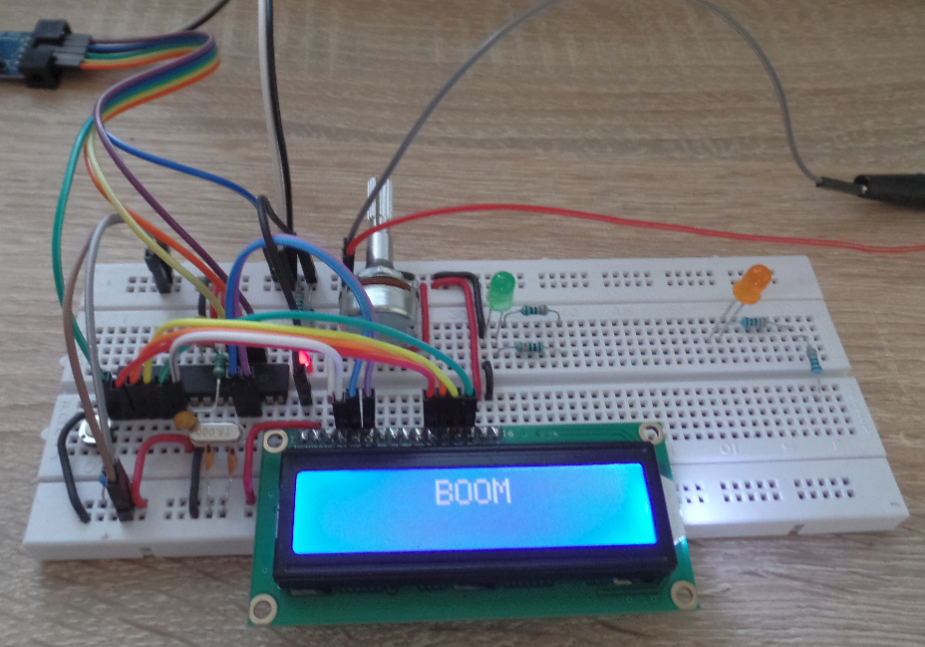

# C Library for HD44780 LCD driver

## HD44780 Description
Detailed information is in [HD44780 Datasheet](https://www.sparkfun.com/datasheets/LCD/HD44780.pdf).

## Hardware connection
| PORT LCD | PORT ATMEGA16A | Description |
| :---: | :---: |  :---: |
| USS | GND | Ground |
| UDD | +5V | Supply Voltage |
| U0 | Potentiometer | Contrast Adjustment |
| RS | PORTD 1 | Data/Instruction Select |
| RW | PORTD 2 | Read/Write Select |
| E | PORTD 3 | Enable Signal |
| D4 | PORTD 4 | Data bit 4 |
| D5 | PORTD 5 | Data bit 5 |
| D6 | PORTD 6 | Data bit 6 |
| D7 | PORTD 7 | Data bit 7 |

## Library
Library is aimed for MCU ATmega16 / Atmega8 which supports [4-bit Operation](#initializing-4-bit-operation).

### Tested
Library was tested and proved on a **_16x2 LCD Display_** with **_Atmega16_**.

### Usage
Prior defined for:
- **_Atmega16 / Atmega8_**
- **_LCD 16x2_**

### Initializing 4-bit operation

Initializing LCD Driver HD44780 according to Figure 24 in [HD44780 Datasheet](https://www.sparkfun.com/datasheets/LCD/HD44780.pdf).
 ```c
// +---------------------------+
// |         Power on          |
// | Wait for more than 15 ms  |   // 15 ms wait
// | after VCC rises to 4.5 V  |
// +---------------------------+
//              |
// +---------------------------+ 
// |  RS R/W DB7 DB6 DB5 DB4   |
// |   0   0   0   0   1   1   |   // Initial sequence 0x30
// | Wait for more than 4.1 ms |   // 4.1 ms us writing DATA into DDRAM or CGRAM
// +---------------------------+
//              |
// +---------------------------+
// |  RS R/W DB7 DB6 DB5 DB4   |
// |   0   0   0   0   1   1   |   // Initial sequence 0x30
// | Wait for more than 0.1 ms |   // 100 us writing DATA into DDRAM or CGRAM
// +---------------------------+
//              |
// +---------------------------+   // Initial sequence 0x30
// |  RS R/W DB7 DB6 DB5 DB4   |   // 37 us writing DATA into DDRAM or CGRAM
// |   0   0   0   0   1   1   |   // 4us tadd - time after BF disapeared
// | Wait for more than 45 us  |   // 37 us + 4 us = 41 us * (270/250) = 45us
// +---------------------------+
//              |
// +---------------------------+   // 4bit mode 0x20
// |  RS R/W DB7 DB6 DB5 DB4   |   // 37 us writing DATA into DDRAM or CGRAM
// |   0   0   0   0   1   0   |   // 4us tadd - time after BF disapeared
// | Wait for more than 45 us  |   // !!! BUSY FLAG CHECK DOESN'T WORK CORRECTLY !!!
// +---------------------------+
//              |
// +---------------------------+
// |  RS R/W DB7 DB6 DB5 DB4   |   // Display off 0x08
// |   0   0   0   0   0   0   |   // 
// |   0   0   1   0   0   0   |   // 
// |    Wait for BF Cleared    |   // Wait for BF Cleared
// +---------------------------+
//              |
// +---------------------------+
// |  RS R/W DB7 DB6 DB5 DB4   |   // Display clear 0x01
// |   0   0   0   0   0   0   |   //
// |   0   0   0   0   0   1   |   //
// |    Wait for BF Cleared    |   // Wait for BF Cleared
// +---------------------------+
//              |
// +---------------------------+
// |  RS R/W DB7 DB6 DB5 DB4   |   // Entry mode set 0x06
// |   0   0   0   0   0   0   |   // 
// |   0   0   0   1   1   0   |   // shift cursor to the left, without text shifting
// |    Wait for BF Cleared    |   // Wait for BF Cleared
// +---------------------------+
```
## Functions

- [HD44780_Init()](#hd44780_init) - init display
- [HD44780_DisplayClear()](#hd44780_displayclear) - clear display and set position to 0, 0
- [HD44780_DisplayOn()](#hd44780_displayon) - turn on display
- [HD44780_CursorOn()](#hd44780_cursoron) - turn on cursor
- [HD44780_CursorOff()](#hd44780_cursoroff) - turn off cursor
- [HD44780_CursorBlink()](#hd44780_cursorblink) - blink the cursor blink
- [HD44780_DrawChar(char)](#hd44780_drawchar) - draw character on display
- [HD44780_DrawString(char *)](#hd44780_drawstring) - draw string
- [HD44780_PositionXY(char, char)](#hd44780_positionxy) - set position X, Y
- [HD44780_Shift(char, char)](#hd44780_shift) - shift cursor or display to left or right

### HD44780_Init
```c
void HD44780_Init (void)
```
Base initialisation function. If the electrical characteristics conditions listed under the table Power Supply Conditions Using
Internal Reset Circuit are not met, the internal reset circuit will not operate normally and will fail to initialize the HD44780U. For such a case, initialization must be performed by the MPU as explained in the section [4-bit Operation](#initializing-4-bit-operation) or 8-bit Operation depending on mode.

### HD44780_DisplayClear
```c
void HD44780_DisplayClear (void)
```
Display clear and set cursor to position 0, 0.

### HD44780_DisplayOn
```c
void HD44780_DisplayOn (void)
```
Turn on the display.

### HD44780_CursorOn
```c
void HD44780_CursorOn (void)
```
Turn on the cursor. Cursor will be visible. IMPORTANT: Function [HD44780_CursorOn()](https://github.com/Matiasus/HD44780#hd44780_cursoron) besides the cursor on, switches the display on, so don't need to use function [HD44780_DisplayOn()](https://github.com/Matiasus/HD44780#hd44780_displayon). But without function [HD44780_CursorOn()](https://github.com/Matiasus/HD44780#hd44780_cursoron) display is switched on by the function [HD44780_DisplayOn()](https://github.com/Matiasus/HD44780#hd44780_displayon).

### HD44780_CursorOff
```c
void HD44780_CursorOff (void)
```
Turn off the cursor. Cursor will be hide but display will be on. 

### HD44780_CursorBlink
```c
void HD44780_CursorBlink (void)
```
Turn the cursor blink. Cursor will be visible and it will blink. IMPORTANT: Function [HD44780_CursorBlink()](https://github.com/Matiasus/HD44780#hd44780_cursorblink) besides the cursor blink, switches the display on, so don't need to use function [HD44780_DisplayOn()](https://github.com/Matiasus/HD44780#hd44780_displayon). But without function [HD44780_CursorBlink()](https://github.com/Matiasus/HD44780#hd44780_cursorblink) display is switched on by the function [HD44780_DisplayOn()](https://github.com/Matiasus/HD44780#hd44780_displayon).

### HD44780_DrawChar
```c
void HD44780_DrawChar (char character)
```
Draw specific char on display according to [ASCII table](http://www.asciitable.com/).

### HD44780_DrawString
```c
void HD44780_DrawString (char *str)
```
Draw string.

### HD44780_PositionXY
```c
char HD44780_PositionXY (char x, char y)
```
Set DDRAM or CGRAM at the specific position X, Y. For LCD 16x2 (cols, rows) maximal possible values:
- X from interval values {0; 1; ... 15},
- Y from interval values {0; 1}.

### HD44780_Shift
```c
char HD44780_Shift (char item, char direction)
```
Shift cursor or display to left or right.
Item defines either cursor or display we want to move. Two possible values for item are defined:
- HD44780_CURSOR, 
- HD44780_DISPLAY.

The second parameter is direction definition. Two possible values for direction are defined:
- HD44780_RIGHT,
- HD44780_LEFT.

# Demonstration


# Links
- [HD44780 Datasheet](https://www.sparkfun.com/datasheets/LCD/HD44780.pdf)
